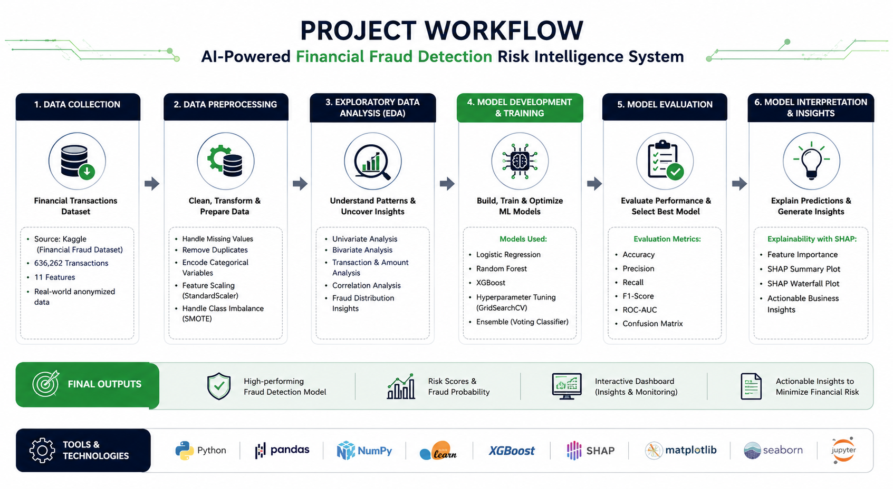
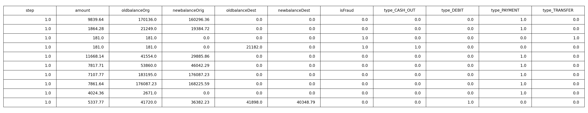
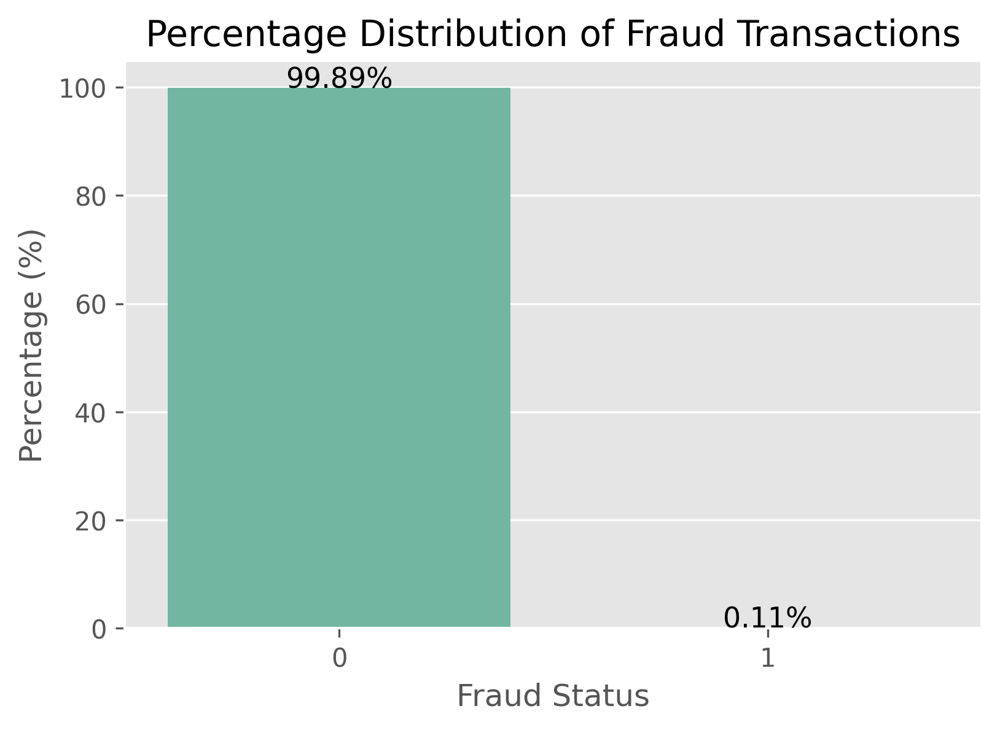
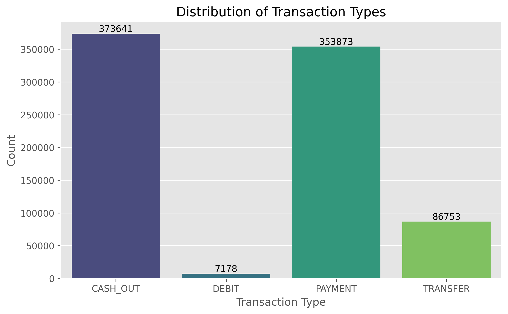
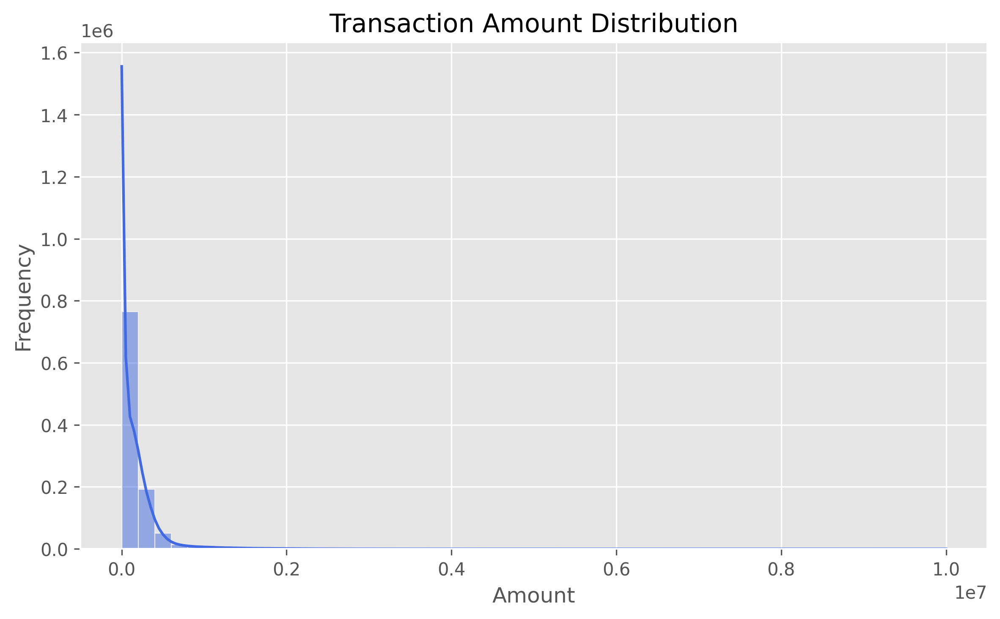
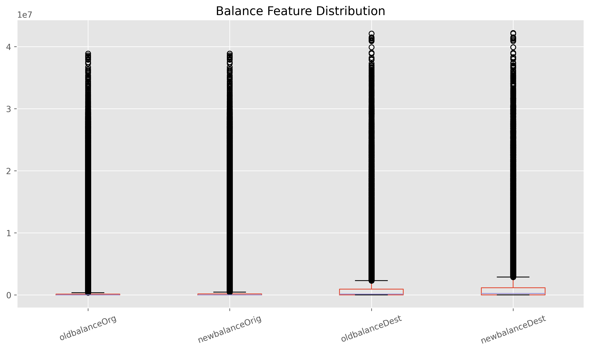
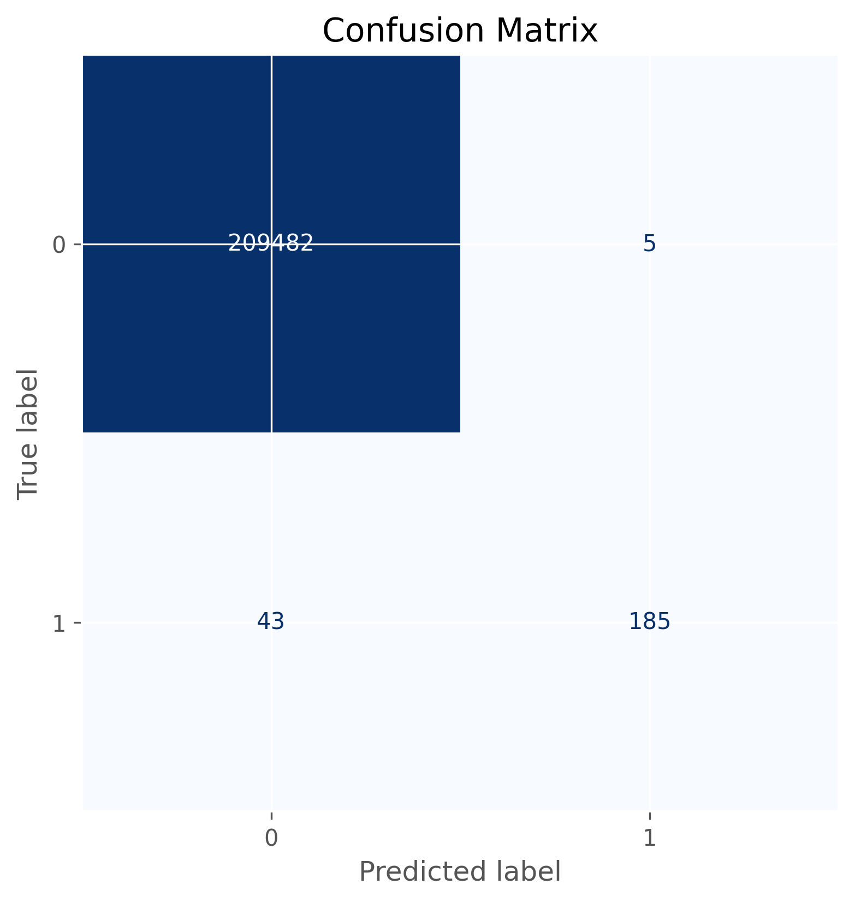
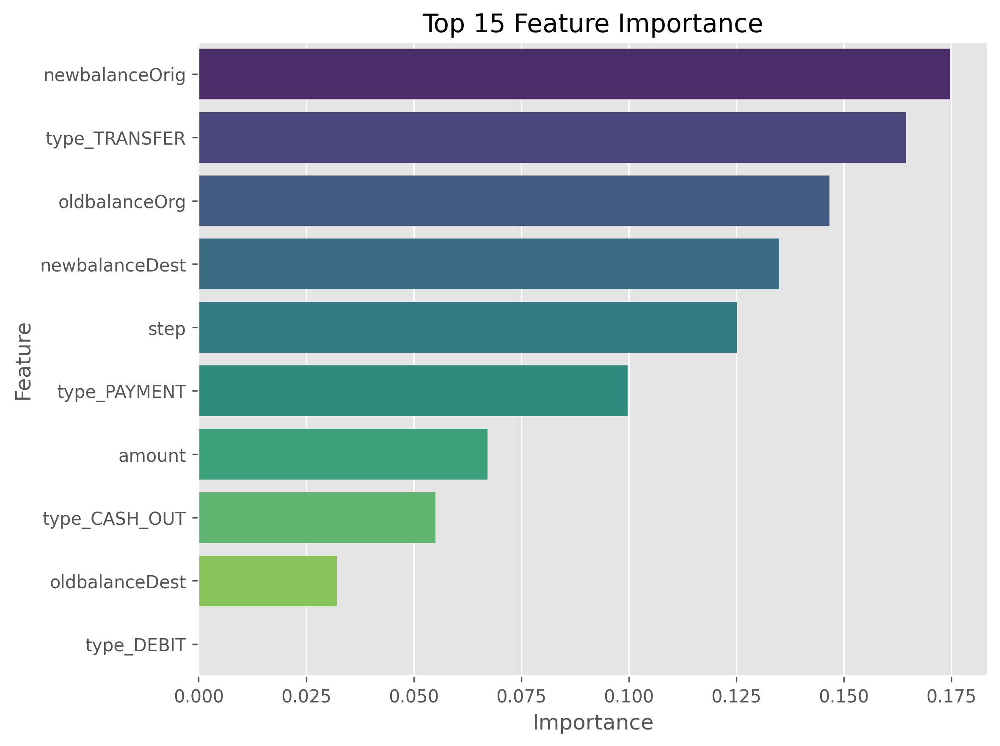
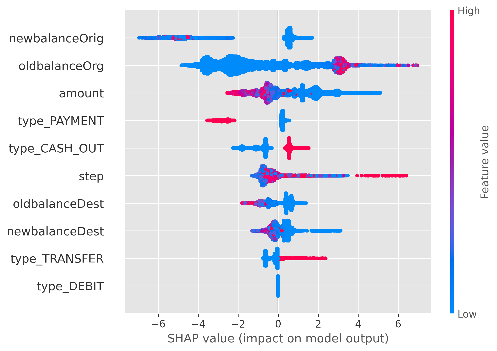
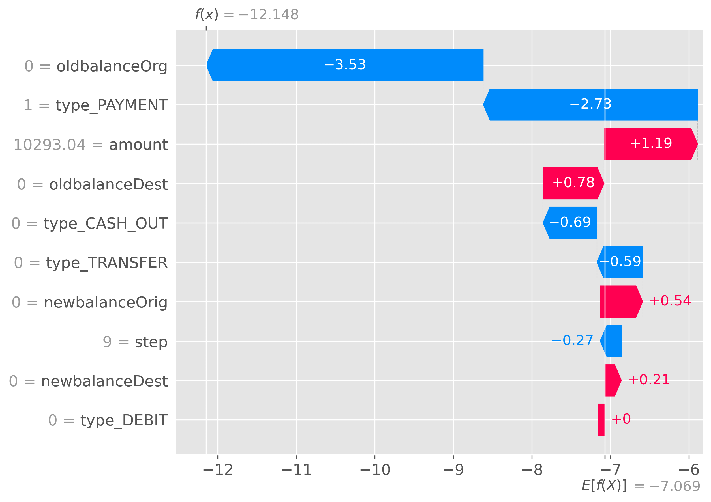

<!-- ========================================================= -->
<!--                      HERO BANNER                          -->
<!-- ========================================================= -->

<p align="center">
  
</p>

<h1 align="center">
🛡️ AI-Powered Financial Fraud Detection & Risk Intelligence System
</h1>

<p align="center">
An End-to-End Explainable Machine Learning Solution for Detecting Fraudulent Financial Transactions using
<b>XGBoost</b>, <b>Hyperparameter Tuning</b>, <b>Threshold Optimization</b>, and <b>SHAP Explainability</b>.
</p>

<p align="center">


</p>

---

# 📖 Project Overview

Financial fraud has become one of the most critical challenges for banks, payment gateways, and digital financial platforms. As transaction volumes continue to grow, traditional rule-based systems struggle to detect evolving fraud patterns while keeping false alerts under control.

This project presents an **end-to-end Explainable Machine Learning pipeline** for detecting fraudulent financial transactions using **XGBoost**, **Hyperparameter Tuning**, **Threshold Optimization**, and **SHAP Explainability**.

Instead of focusing only on prediction accuracy, the project emphasizes building a practical fraud detection solution that balances predictive performance, business impact, and model interpretability.

---

# 🚨 Business Problem

Every day, financial institutions process millions of transactions, making manual fraud detection nearly impossible.

Traditional fraud detection systems rely heavily on predefined rules that often fail to identify sophisticated fraud patterns. As fraud techniques evolve, these systems generate large numbers of false alerts while still missing genuine fraudulent transactions.

This creates several business challenges:

- 💸 Financial losses due to undetected fraudulent transactions.
- ⚠️ High operational costs caused by excessive false positives.
- 📉 Reduced customer trust and satisfaction.
- 🏦 Increased regulatory and compliance risks.

The objective is to build an intelligent Machine Learning solution capable of accurately detecting fraudulent transactions while minimizing unnecessary investigations.

---

# 💡 Proposed Solution

To overcome the limitations of traditional rule-based systems, this project implements an end-to-end Machine Learning workflow that learns complex fraud patterns directly from historical transaction data.

The complete solution combines:

- 🤖 **XGBoost** for high-performance fraud classification.
- ⚙️ **Hyperparameter Tuning** to improve model robustness.
- 🎯 **Threshold Optimization** to balance Precision and Recall.
- 🧠 **SHAP Explainability** to make model predictions transparent and interpretable.

Together, these components create a practical fraud detection system suitable for real-world financial risk management.

---

# ⭐ Key Features

| Feature | Description |
|---------|-------------|
| 🛡️ Intelligent Fraud Detection | Predicts fraudulent financial transactions using Machine Learning. |
| ⚡ XGBoost Classifier | High-performance Gradient Boosting model for structured financial data. |
| ⚙️ Hyperparameter Tuning | Optimizes model performance and generalization capability. |
| 🎯 Threshold Optimization | Improves the balance between fraud detection and false alerts. |
| 🧠 Explainable AI | Uses SHAP to explain individual model predictions. |
| 📊 Business-Oriented Solution | Designed to support practical financial risk management. |
| 🔄 End-to-End ML Pipeline | Covers preprocessing, feature engineering, modeling, optimization, and explainability. |

---

# 🛠️ Technology Stack

| Category | Technologies |
|----------|--------------|
| Programming Language | Python |
| Data Analysis | Pandas, NumPy |
| Data Visualization | Matplotlib, Seaborn |
| Machine Learning | Scikit-learn, XGBoost |
| Explainable AI | SHAP |
| Development Environment | Jupyter Notebook |

---

# 🔄 Solution Workflow

<p align="center">

</p>

```text
Business Understanding
        │
        ▼
Data Collection
        │
        ▼
Data Preparation
        │
        ▼
Exploratory Data Analysis
        │
        ▼
Feature Engineering
        │
        ▼
Model Development
        │
        ▼
Hyperparameter Tuning
        │
        ▼
Threshold Optimization
        │
        ▼
Model Evaluation
        │
        ▼
Explainable AI (SHAP)
```

---

# 📂 Understanding the Dataset

The project uses a structured financial transaction dataset where each record represents an individual transaction with multiple attributes describing transaction behavior.

The objective is to classify every transaction as either:

- ✅ Legitimate Transaction
- 🚨 Fraudulent Transaction

Since fraudulent transactions represent only a very small portion of the overall dataset, this is treated as a **highly imbalanced binary classification problem**, making fraud detection significantly more challenging than conventional classification tasks.

---

## 📋 Dataset Overview

| Property | Details |
|----------|---------|
| Domain | Financial Fraud Detection |
| Problem Type | Binary Classification |
| Target Variable | `isFraud` |
| Dataset Type | Structured Transaction Data |
| Primary Challenge | Highly Imbalanced Classes |

---

# 🗂️ Dataset Preview

<p align="center">

</p>

> **Figure:** Preview of the transaction dataset used for fraud detection.

---

# 🧹 Data Preparation

Before model development, the dataset was carefully prepared to improve data quality and ensure reliable model performance.

The preprocessing pipeline included:

- ✔ Data type validation
- ✔ Missing value inspection
- ✔ Duplicate record verification
- ✔ Consistency checks
- ✔ Feature selection for model training

These preprocessing steps ensured that the final dataset was clean, consistent, and ready for Machine Learning.

---

# 📊 Exploratory Data Analysis (EDA)

Exploratory Data Analysis was performed to understand transaction behavior, identify fraud patterns, and uncover important relationships within the dataset before model development.

The analysis focused on:

- Fraud distribution across transactions.
- Transaction type comparison.
- Transaction amount patterns.
- Balance-related transaction behavior.

These insights helped guide feature engineering and model development.

---

## 🚨 Fraud Distribution

<p align="center">

</p>

> **Insight:** The dataset is highly imbalanced, with legitimate transactions significantly outnumbering fraudulent ones.

---

## 💳 Transaction Type Analysis

<p align="center">

</p>

> **Insight:** Fraud occurrences vary across transaction types, highlighting categories with higher fraud risk.

---

## 💰 Transaction Amount Analysis

<p align="center">

</p>

> **Insight:** Fraudulent transactions exhibit distinct transaction amount patterns compared to legitimate transactions.

---

## 💵 Balance Analysis

<p align="center">

</p>

> **Insight:** Account balance behavior provides valuable signals for distinguishing fraudulent transactions.

---

> **The next section covers Feature Engineering, Model Development, Hyperparameter Tuning, Threshold Optimization, Explainable AI, and the final model performance.**


# ⚙️ Feature Engineering

Feature Engineering plays a crucial role in improving the predictive capability of Machine Learning models. Rather than relying solely on raw transaction data, the dataset was transformed into a model-ready format that captures meaningful transaction patterns.

The primary objectives of feature engineering were to:

- ✔ Improve feature quality
- ✔ Prepare model-ready inputs
- ✔ Preserve important transaction information
- ✔ Enhance model learning capability
- ✔ Reduce unnecessary complexity

A well-prepared feature set enables the model to distinguish fraudulent transactions more effectively while improving overall robustness and generalization.

---

# 🤖 Model Development

Several Machine Learning algorithms were evaluated before selecting the final model.

Each model was assessed based on its ability to:

- Detect fraudulent transactions accurately
- Handle highly imbalanced data
- Generalize well on unseen transactions
- Maintain business-oriented performance

Instead of selecting a model based only on accuracy, the evaluation focused on achieving the best balance between **Precision**, **Recall**, **F1-Score**, and **ROC-AUC**, which are more suitable metrics for fraud detection.

---

# 🚀 Why XGBoost?

After comparing multiple algorithms, **XGBoost** was selected as the final model because it consistently delivered the strongest performance on structured financial transaction data.

### Key Advantages

- ⚡ Excellent performance on tabular datasets
- 🎯 Captures complex non-linear relationships
- 📉 Handles class imbalance effectively
- 🛡️ Strong resistance to overfitting
- 🧠 Fully compatible with SHAP Explainability
- 🚀 Fast training and efficient prediction

These characteristics make XGBoost one of the most reliable algorithms for modern financial fraud detection systems.

---

# ⚙️ Model Optimization

Building a high-performing Machine Learning model requires more than selecting the right algorithm. To maximize predictive performance, the selected XGBoost model was further optimized using Hyperparameter Tuning and Threshold Optimization.

---

## 🔧 Hyperparameter Tuning

Hyperparameter optimization was performed to improve:

- Model Stability
- Generalization Performance
- Prediction Quality
- Overall Robustness

Carefully tuning model parameters enabled the classifier to achieve stronger performance while reducing the risk of overfitting.

---

## 🎯 Threshold Optimization

By default, classification models use a probability threshold of **0.50**. However, in fraud detection, missing a fraudulent transaction is often far more costly than reviewing a legitimate one.

To improve real-world performance, multiple probability thresholds were evaluated.

After experimentation, a threshold of **0.35** was selected because it provided the best balance between **Precision**, **Recall**, and **F1-Score**.

This optimization significantly improved the model's ability to detect fraudulent transactions while keeping false alerts under control.

---

# 🔄 Machine Learning Pipeline

```text
Raw Transaction Data
        │
        ▼
Data Preparation
        │
        ▼
Exploratory Data Analysis
        │
        ▼
Feature Engineering
        │
        ▼
Train-Test Split
        │
        ▼
Model Training (XGBoost)
        │
        ▼
Hyperparameter Tuning
        │
        ▼
Threshold Optimization
        │
        ▼
Model Evaluation
        │
        ▼
Explainable AI (SHAP)
```

---

# 📊 Final Model Performance

Since fraud detection is a highly imbalanced classification problem, multiple evaluation metrics were used to assess the effectiveness of the final model rather than relying on accuracy alone.

## 📈 Performance Metrics

| Metric | Score |
|---------|------:|
| 🎯 Accuracy | **99.98%** |
| 🎯 Precision | **97.37%** |
| 🎯 Recall | **81.14%** |
| 🎯 F1-Score | **88.52%** |
| 🎯 ROC-AUC | **99.56%** |

The optimized **XGBoost** model achieved outstanding predictive performance while maintaining an effective balance between detecting fraudulent transactions and minimizing false positives.

---

# 📊 Confusion Matrix

The Confusion Matrix provides a detailed breakdown of the model's classification performance by comparing predicted labels with the actual transaction classes.

It helps evaluate how effectively the model distinguishes between legitimate and fraudulent transactions while highlighting the number of correct and incorrect predictions.

<p align="center">

</p>

> **Insight:** The optimized XGBoost model correctly classified the vast majority of legitimate and fraudulent transactions, demonstrating strong predictive performance with minimal misclassification.

---


# 📌 Feature Importance

Understanding which features influence model predictions is essential for building trustworthy Machine Learning systems.

The trained XGBoost model provides feature importance scores that highlight the variables contributing most to fraud detection.

<p align="center">

</p>

> **Insight:** A small number of transaction-related features contribute significantly to the model's decision-making process, providing valuable information for fraud analysts.

---

# 🧠 Explainable AI (SHAP)

High prediction accuracy alone is not sufficient in financial applications. Financial institutions also need to understand **why** a transaction has been classified as fraudulent.

To improve transparency, this project integrates **SHAP (SHapley Additive Explanations)**, enabling interpretable Machine Learning predictions.

SHAP measures the contribution of each feature to an individual prediction, allowing analysts to understand model behavior instead of relying on a black-box system.

---

## 🌍 SHAP Summary Plot

<p align="center">

</p>

> **Insight:** The SHAP Summary Plot ranks features according to their overall impact on model predictions, helping identify the most influential variables driving fraud detection.

---

## 🔍 SHAP Waterfall Plot 


<p align="center">

</p>

> **Insight:** The SHAP Waterfall Plot explains how individual feature contributions move a single transaction from the base prediction to the final fraud probability.

---

> **The final section presents the business impact, repository structure, quick start guide, developer information, and future enhancements.**


# 💼 Business Impact

Beyond achieving outstanding predictive performance, this project demonstrates how Explainable Machine Learning can solve real-world financial fraud challenges.

The proposed solution helps financial institutions by:

- 🛡️ Detect fraudulent transactions more accurately.
- 💰 Reduce financial losses caused by fraud.
- ⚡ Improve investigation efficiency.
- 📉 Minimize unnecessary false alerts.
- 🧠 Increase transparency through Explainable AI.
- 🤝 Build greater customer trust with intelligent fraud prevention.

Rather than focusing only on prediction accuracy, this project emphasizes creating an interpretable and business-oriented fraud detection solution.

---

# 🚀 Future Enhancements

Possible future improvements include:

- 🌐 Real-Time Fraud Detection API
- 📊 Interactive Streamlit Dashboard
- ☁️ Cloud Deployment (AWS / Azure / GCP)
- ⚙️ End-to-End MLOps Pipeline
- 🔄 Automated Model Retraining
- 📈 Continuous Model Monitoring
- 🤖 Deep Learning-Based Fraud Detection

---

# 📁 Repository Structure

```text
AI-Powered-Financial-Fraud-Detection/
│
├── assets/
│   ├── banner.png
│   ├── workflow.png
│   ├── dataset_preview.png
│   ├── fraud_distribution.png
│   ├── transaction_type_analysis.png
│   ├── transaction_amount_analysis.png
│   ├── balance_analysis.png
│   ├── confusion_matrix.png
│   ├── feature_importance.png
│   ├── shap_summary.png
│   └── shap_waterfall.png
│
├── data/
│
├── notebooks/
│   └── AI_Powered_Financial_Fraud_Detection.ipynb
│
├── requirements.txt
├── README.md
├── LICENSE
└── .gitignore
```

---

# ⚡ Quick Start

### Clone the Repository

```bash
git clone https://github.com/alinkumar2977/AI-Powered-Financial-Fraud-Detection.git
```

### Navigate to the Project Directory

```bash
cd AI-Powered-Financial-Fraud-Detection
```

### Install Dependencies

```bash
pip install -r requirements.txt
```

### Launch Jupyter Notebook

```bash
jupyter notebook
```

Run all notebook cells sequentially to reproduce the complete fraud detection pipeline.

---

# 🎯 Project Highlights

| Highlights | |
|------------|----------------|
| 🤖 Model | XGBoost |
| 🎯 Threshold | 0.35 |
| 🧠 Explainability | SHAP |
| 📊 Problem | Fraud Detection |
| 📈 ROC-AUC | 99.56% |
| ⚡ Accuracy | 99.98% |

---

# 👨‍💻 About the Author

Passionate about building scalable Machine Learning solutions that bridge the gap between data, business strategy, and intelligent decision-making.

I enjoy building end-to-end projects that combine strong technical foundations with meaningful business impact. Every project in my portfolio reflects my commitment to writing clean, reproducible code and creating practical, data-driven solutions.

---


## 🤝 Connect With Me

[](https://github.com/alinkumar)

[](https://www.linkedin.com/in/alinkumar2977/)

---

# 📄 License

This project is licensed under the **MIT License**.

---

<div align="center">

---

<div align="center">

## ⭐ Thank You for Visiting

If this project helped you or inspired you, consider giving it a ⭐ on GitHub.

I appreciate your feedback, suggestions, and collaboration opportunities.

### 🚀 Building Explainable AI Solutions for Smarter Financial Decision-Making

**© 2026 Alin Kumar**

</div>